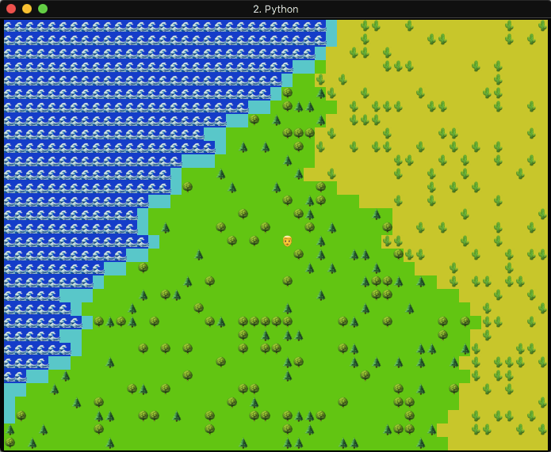

# Emoji Rogue Demo

A prototype/demo of using Emoji as sprites in a terminal rogue-like game.

## Usage

There are no external dependecies for the demo, it should run in any vanilla Python 3 environment. I.e. like this:

    $ python3 main.py

## TODO

 - Optimise engine.gfx.flip() rendering to:
    a. output newline instead of padding spaces at end of line
    b. only output background/foreground colours when they have changed
    c. output tabs for sections of 8 spaces
 - Handle resizing of the terminal window
 - Better parsing of inputs, allowing:
    a. arrow keys etc.
    b. multiple inputs (e.g. left and up at the same time etc.)
